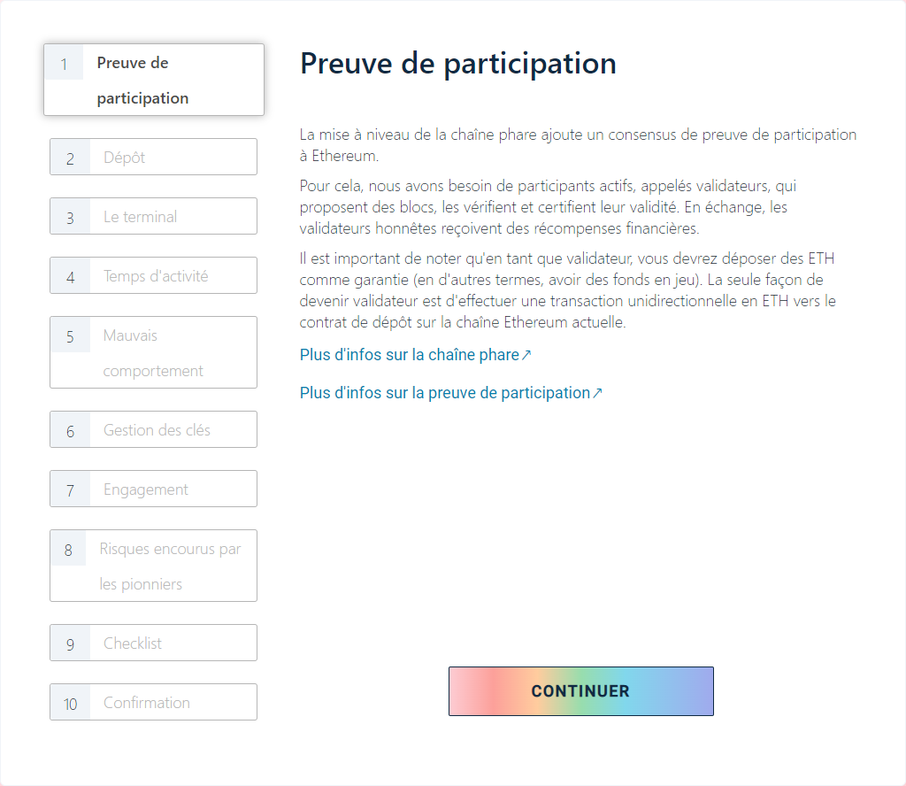
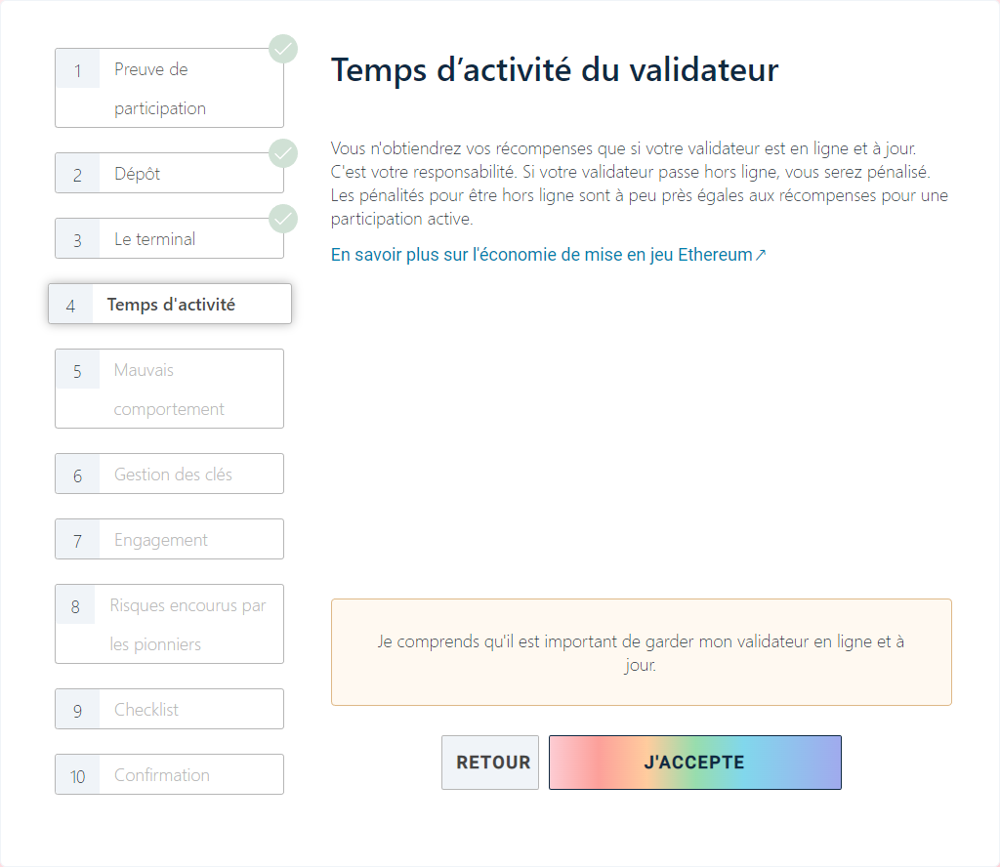
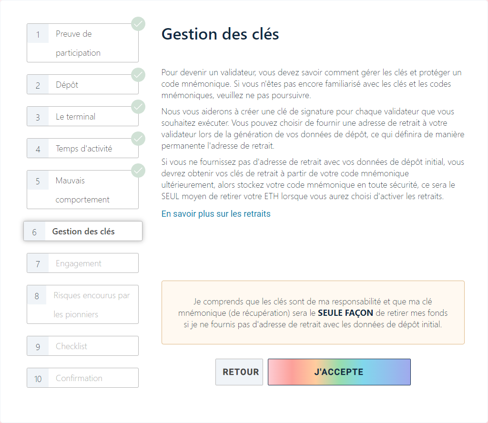
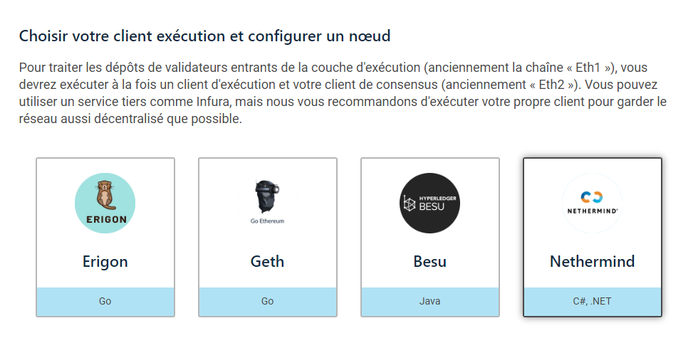

# Procédure pour le dépôt


Ne faites confiance à aucun lien lors du dépôt d'ETH dans le contrat de staking.

**Vérifiez toujours l'adresse du contrat de dépôt à partir de PLUSIEURS sources :**

[https://ethereum.org/fr/staking/deposit-contract/](https://ethereum.org/fr/staking/deposit-contract/)


Une fois que vous avez configuré votre machine avec un [client d'exécution](../validator-clients/execution-clients.md) et un [client de consensus](../validator-clients/consensus-clients.md), vous êtes prêt à commencer le processus de dépôt.

Les dépôts de staking sont traités via la plateforme de lancement ethereum.org :

[https://launchpad.ethereum.org/fr/overview](https://launchpad.ethereum.org/fr/overview)

Les captures d'écran suivantes montrent le processus de dépôt.

<figure><figcaption></figcaption></figure>

<figure><figcaption></figcaption></figure>

<figure><figcaption></figcaption></figure>

<figure><figcaption></figcaption></figure>

<figure><figcaption></figcaption></figure>

<figure><figcaption></figcaption></figure>

<figure><figcaption></figcaption></figure>

<figure><figcaption></figcaption></figure>

<figure><figcaption></figcaption></figure>

<figure><figcaption></figcaption></figure>

### Choisir un client d'exécution

<figure><figcaption></figcaption></figure>

### Choisir un client de consensus

<figure><figcaption></figcaption></figure>

### Générer votre paire de clés

<figure><figcaption></figcaption></figure>

### Définir une adresse de retrait pour vos récompenses ou en cas de sortie du validateur

<figure><figcaption></figcaption></figure>

### Quel est votre système d'exploitation actuel ?

<figure><figcaption></figcaption></figure>

### Comment voulez-vous générer vos clés ?

<figure><figcaption></figcaption></figure>

### Enregistrer le fichier pour le validateur

<figure><figcaption></figcaption></figure>

### Enregistrer le fichier pour le dépôt des 32 ETH

<figure><figcaption></figcaption></figure>

### Déposer le fichier json

<figure><figcaption></figcaption></figure>

### Connecter votre portefeuille puis faite le dépôt

<figure><figcaption></figcaption></figure>

Félicitations ! Vous avez enclenché le processus pour activer votre validateur.

\
