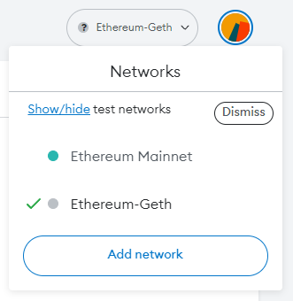

# Monitoring at scale

<figure><figcaption></figcaption></figure>

In the realm of large-scale Ethereum staking operations, effective monitoring is crucial for maintaining network health and validator performance. This section introduces the standard beacon API and metrics, pivotal in overseeing a vast array of validators. We'll also explore the potential of open-sourced dashboards, which could revolutionize how these metrics are visualized and managed.

### **🔢 Standard Beacon API & Metrics**

The Beacon API serves as a gateway to the Ethereum beacon chain, providing standardized, accessible data crucial for monitoring validator performance and overall network health. This API offers detailed insights into various metrics like validator uptime, proposed blocks, missed attestations, and more. The API's standardized format ensures data can be easily integrated into various monitoring tools and dashboards, allowing for a cohesive and comprehensive view of the network's status.

### **📊 Open-Sourced Dashboards**

Projects such as [Metanulls ETH2-Grafana dashboards](https://github.com/metanull-operator/eth2-grafana) can act as a starting point for open-source dashboards.

* **Customizable Views**:\
  One of the key features of these dashboards would be the ability to customize views according to specific needs. Operators could tailor dashboards to focus on metrics most relevant to their operations, such as real-time validator performance, network participation rates, or epoch summaries.
* **Advanced Features**:\
  Imagine dashboards equipped with features like real-time data visualization, which would allow operators to see network changes as they happen. Historical data analysis tools could enable operators to identify trends over time, providing insights into long-term performance and network health. The integration of customizable alerts would mean operators can be immediately notified of potential issues, allowing for prompt response to maintain network integrity.
* **Community Contribution**:\
  The open-source nature of these dashboards encourages community collaboration, leading to continuous improvements and innovations. This communal effort can significantly advance the way Ethereum staking operations are monitored at scale.

### **📦 Data Storage and Retention**

* **How Long to Store Data**:\
  The decision on the duration of data storage for monitoring Ethereum validators is pivotal. It influences not just operational analysis but also compliance and resource allocation.
* **Factors Influencing Storage Duration**:\
  Key factors include regulatory compliance requirements, which may dictate minimum storage periods for certain types of data; the capacity for data storage, as extensive data can demand significant storage resources; and the practical utility of historical data in identifying trends and making informed decisions.
* **Strategic Planning for Data Retention**:\
  Operators need to balance the need for comprehensive historical data with practical considerations of storage capacity and management.

### &#x20;**🔔 Alerting and Metrics**


**Check out the "**[**Alerting at scale**](alerting-at-scale.md)**" page for more detailed information on alerting.**


* **Proactive Monitoring**:\
  Proactive monitoring transcends the reactive nature of alerts. It involves a continuous, comprehensive review of the system’s health and performance metrics. Regularly schedule system health checks, analyze performance trends, and anticipate potential issues before they escalate. This approach helps in maintaining optimal system performance and preventing downtime.
* **Balancing Alerts**:\
  The efficacy of alert systems can be compromised by an overload of notifications, leading to 'alert fatigue'. Striking a balance is crucial. Prioritize and categorize alerts based on severity and impact. This helps in ensuring that critical issues are addressed promptly and less critical alerts do not cause unnecessary distractions.
*   **Regular Audits and Updates**:

    The dynamic nature of Ethereum's network and validators necessitates regular audits and updates of the monitoring system. Schedule periodic reviews of the monitoring setup. Update alert parameters and monitoring tools to keep pace with network changes and evolving operational needs.
*   **Documentation and Training**:

    Comprehensive documentation and proper training are essential for the effective use of monitoring tools and understanding alerts. Maintain detailed documentation of all monitoring procedures, alert systems, and operational guidelines. Conduct regular training sessions for team members to ensure they are adept at using these tools and responding to alerts.
*   **Community Involvement**:

    Engagement with the broader Ethereum community is a valuable resource for staying abreast of best practices and emerging trends in monitoring technologies. Actively participate in community forums, attend webinars, and collaborate with other operators. Sharing experiences and insights can lead to enhanced monitoring strategies and a more resilient Ethereum staking ecosystem.

***

Effective monitoring at scale is an evolving discipline that requires a blend of robust technology, strategic planning, and continuous learning. By leveraging standard APIs, implementing essential alerts, and following best practices, large-scale node operators can maintain high performance and security in their Ethereum staking operations.

### 📖 Other Resources



> The information in the Scaled Node Operators section has been written and reviewed by [Igor Mandrigin](https://x.com/mandrigin) and [Gateway.fm](https://gateway.fm), a leading large scale Ethereum staking infrastructure provider.
